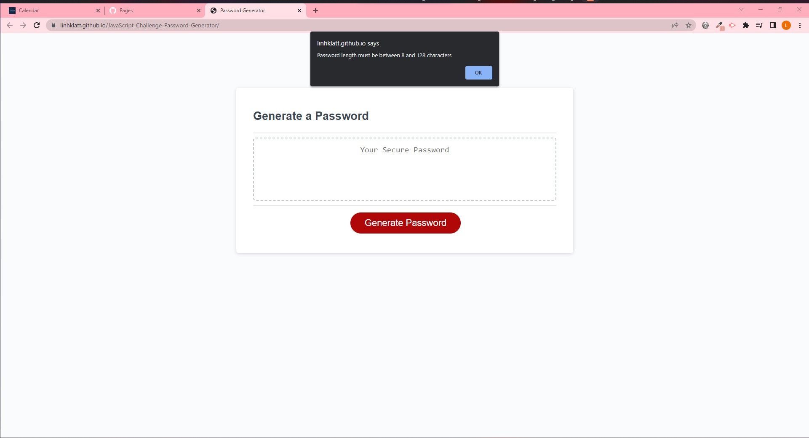
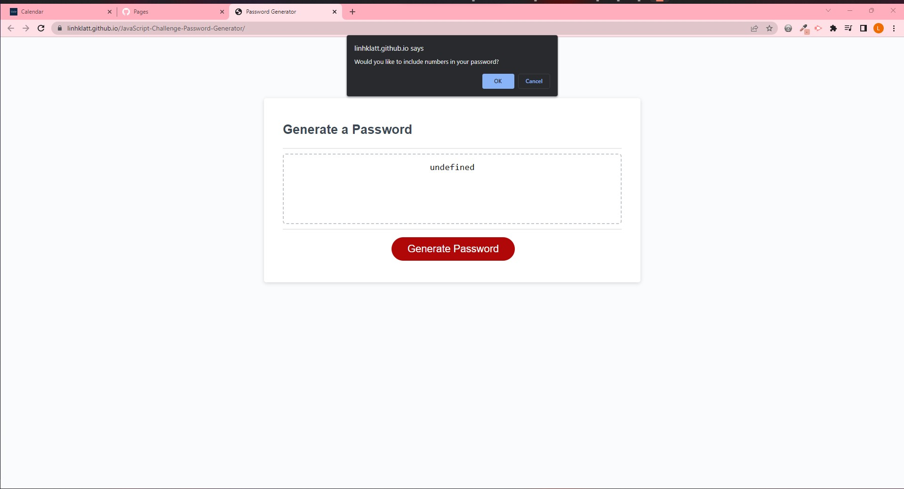
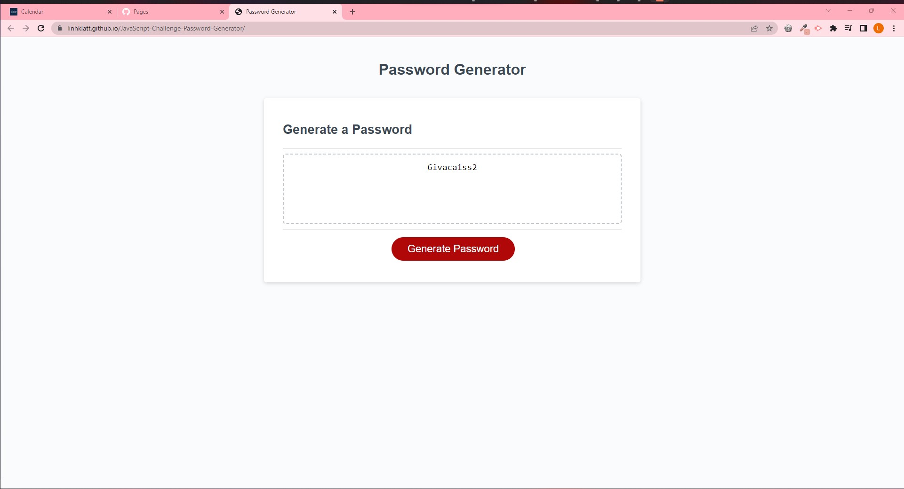

# Password Generator Starter Code

## Description

For this challenge, I was given finished HTML, CSS code and undone/starter JS Code. My job is to write full JS code to create an application called Password Generator which is allowed users to generate a random password base on their need. They have 4 options to choose including : numbers, lower cases, upper cases and special character and the length limited from 8 to 128 characters. When the users have choose their options, the application will run and give them the random password base on the users choices!

## Usage

1. Click on this link below to navigate to the application:

   https://linhklatt.github.io/JavaScript-Challenge-Password-Generator/

2. Password Generator Application will appear as the screen shot below:

   
   This screen shot explains the users how to choose their password.

   
   This screen shot lets the users know that the characters length have to be between 8 and 128 characters

   
   The users will see that they have 4 options to choose for their password to be ( including numbers, lower cases, upper cases, and special characters).

   
   This is a sample result after the users have choose their password options.

## Credit

N/A

## License

Please refer to the license in the repo.
